# Unity Learn Basic
## Working with Unity
* **Short cut:**
    - Ctrl + N: Tạo một GameObject Empty
    - Alt + Shift + N: Tạo một GameObject Empty trong một GameObject khác
    - Ctrl + = : Trỏ vào đối tượng đầu tiền trong một đối list các đối tượng con của một đối tượng khác
    - Ctrl + - : Trỏ vào đối tượng cuối cùng trong một đối list các đối tượng con của một đối tượng khác
## Scripting 
* **Short:**
    - Object Pool: Tạo các prefabs với hiệu năng cao hơn so với destroy
    - Singleton([Code](https://github.com/Karysqa12xc/Unity-Learn-Basic/blob/main/Assets/_Scripts/Chapter02/Scripting/Singleton.cs)): Một design pattern được sử dụng để code không bị lặp và được khởi tạo một lần duy nhất( tác hại là code sẽ dễ bị phụ thuộc nên cần phải lưu ý )
## Input:
* **Short:**
    - Input System: Được cài đặt bằng Package Manager, đây là hệ thống quản lý điều kiểu object do unity tạo ra.
    - Có thể sử dụng các thuộc tính của Cursor để tác động lên con trỏ chuột trong trò chơi.
    - Sử dụng Event Systems và Camera được gắn Component Physics Raycaster và các Interface(IPointerEnterHandler,IPointerExitHandler,IPointerUpHandler,IPointerDownHandler,
    IPointerClickHandler) để chọn đối tượng trong trò chơi bằng con trỏ chuột.
## Mathematics(Vector, Rotating, Matrix, Angle)
* **Short:**
    - Tính khoảng cách giữa hai Vector: 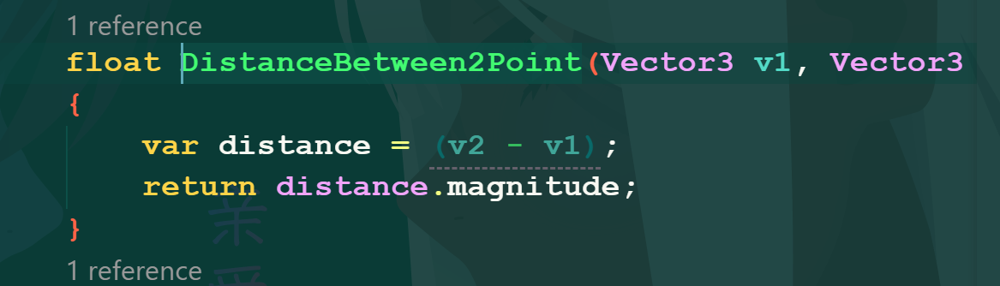
    - Chuẩn hoá Vector: 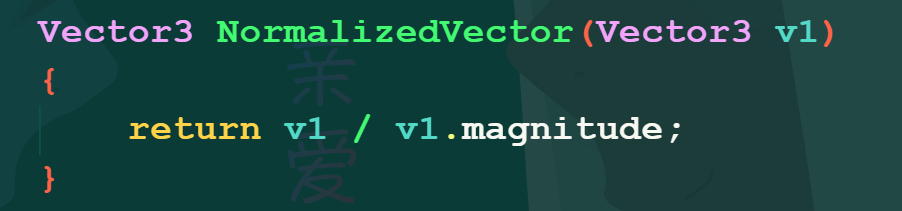
    - Tính tích vô hướng giữa hai Vector: 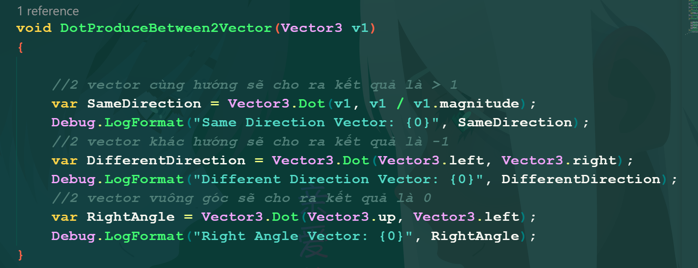
    - Quaternion có 4 giá trị(x, y, z, w)
    - Cách thực hiện phép quay: 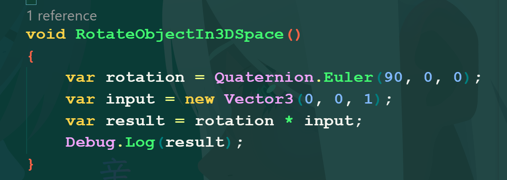
    - Sử dụng hàm Slerp để hoà trộn hai góc quay với nhau: 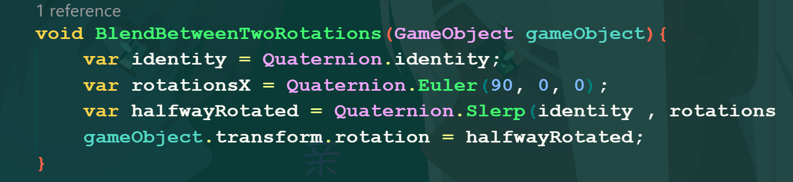
    - Kết hợp Quaternion: 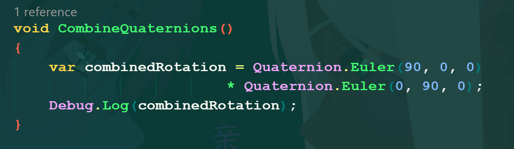
    - Thao tác cơ bản với ma trận 4x4: 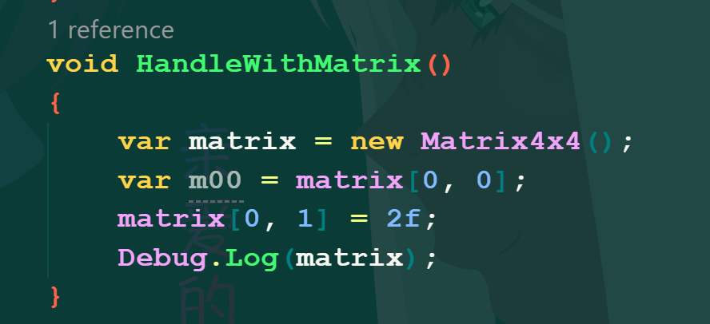
    - Cách tạo ma trận 4x4 bằng Vector: 
    - Cách nhân vector với ma trận 4x4: 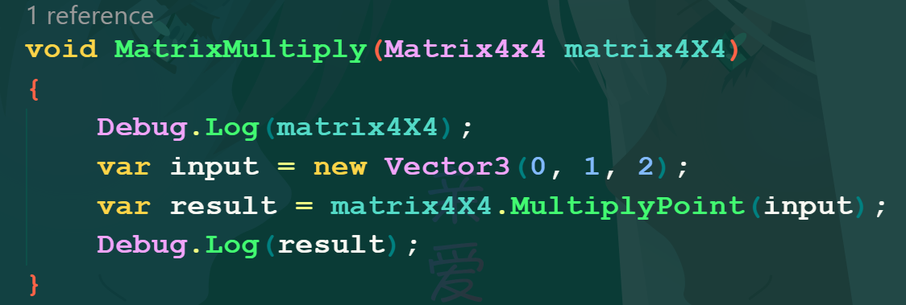
    - Cách nối thủ công các ma trận với nhau: 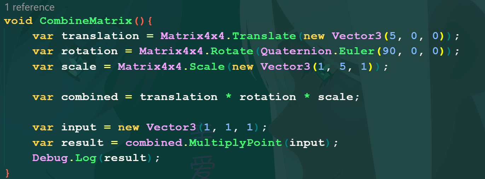
    - Cách nối các ma trận với nhau nhưng sử dụng hàm: 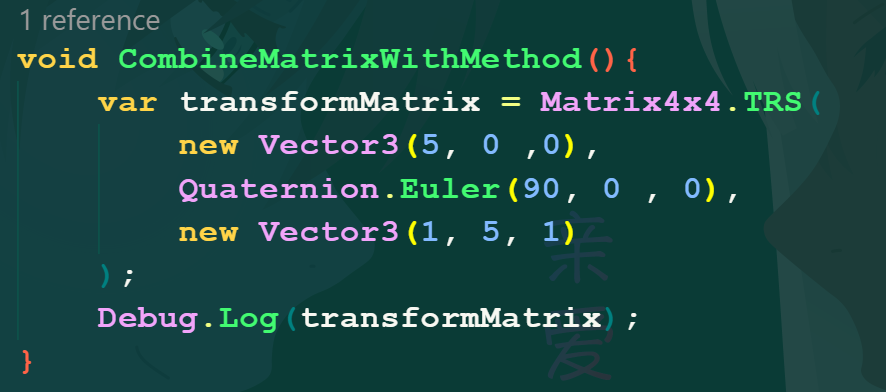
    - Cách chuyển đổi góc có giá trị là độ sang radian: 
    - Cách chuyển đổi góc có giá trị là radian sang độ: 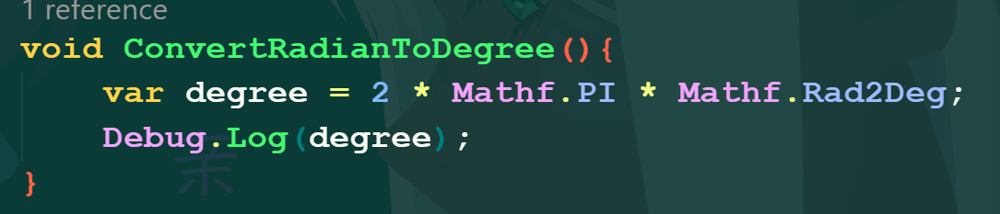
    - Để tính góc giữa hai vector ta sử dụng hàm Acos của Mathf đối với tích vô hướng của hai vector: 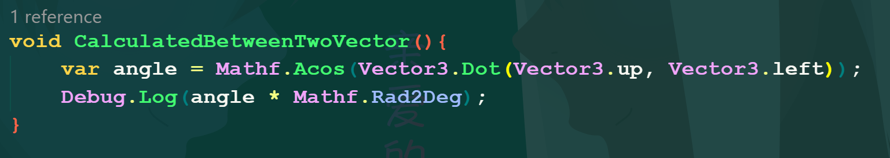
## 2D Graphics
* **Short:**
    - Để sử dụng hình ảnh trong Unity2D ta chỉ cần kéo hình ảnh đó vào thư mục trong cửa sổ Project của Unity và chuyển Texture Type thành Sprite (2D and UI).
    - Để sử dụng Sprite trong Scene thì GameObject đó phải có Component tên là "Sprite Renderer".
    - Dùng Custom Physics Shape trong Sprite Editor để xác định hình dạng Collider của Polygon Collider 2d.
    - Dùng Component Composite Collider để gộp chung các Collider con với nhau: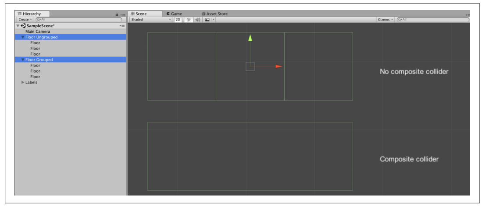
    - Sử dụng Sprite Atlas để sử dụng một gói các Sprite cho một texture duy nhất để tránh lạng phí bộ nhớ.
    - Sử dụng Component "Constant Force 2D" để tác động một lực vào vật thể được gắn Component này.
    - Dùng Effector để mô phỏng lực tự nhiên và một số chức năng mở rộng(Area Effector, Buoyancy Effector, Platform Effector, Surface Effector)
    - Sử dụng Component "Sprite Group" để hiển thị đồng thời các ảnh của GameObject con trong GameObject cha.
    - Để tạo Scene 2.5D ta chỉnh Projection của Camera thành Perspective và tạo một Background ở xa Camera, lúc này nếu di chuyển Camera sang trái hoặc phải sẽ tạo cảm giác 3d.
## 3D Graphics:
* **Short: **
    - Để tạo materials không ảnh hương bởi ánh sáng phản chiếu trong trò chơi thì chọn chế độ Unlit => Color cho material.
    - Dùng texture để tạo material chân thật có thể search trên các tranh như [ambientcg](https://ambientcg.com/) hay [polyhaven](https://polyhaven.com/)
    - Để tạo các hiệu ứng sử lý hậu kì cho Camera trong game ta dùng Component là post-processing effect(để có nó ta cài đặt trong package manager) => Hiệu ứng này chỉ có thể sử dụng ở 2D(Core) và 3D(Core) cụ thể là chỉ có thể sử dụng với Built-In Render Pipeline.
    - Đặc điểm của Built-In Render Pipeline là nó có thể tạo ra các hình ảnh với chất lượng tốt ở trên bất kỳ System nào nhưng đi kèm với nó là hiệu suốt để đáp ứng nó cần được tính toán cẩn thận.
    - Đối với 3D(URP) và 2D(URP) ta có thể tạo chức tiếp Post-Processing mà không cần tải Package bên ngoài bằng Volume Component(Đặc điểm của trình render này phù hợp với bất kỳ các loại cấu hình máy nào).
    - Sử dụng Shader Graph(Create → Shader →
    URP → Lit Shader Graph).
    - Để cho một đối tượng có thể ánh xạ ánh sáng ta vào cửa sổ Inspector chọn drop-down menu và chọn Contribute GI.
    - Tạo vật thể có thể phát ra ánh sáng(**Emission**): [Link](https://youtu.be/2PBgCl-zIZQ?si=xsuADgz6vmOd3-gT)
    - Sử dụng Light Probes: [Link](https://youtu.be/_E0JXOZDTKA?si=N4WyCSP8NttY_kUn)
    - Sử dụng Reflection Probes để tạo hình ảnh phản chiếu cho material trong môi trượng xung quanh(Có thể ứng dụng để tạo các hiệu ứng của gương): [Link](https://youtu.be/wol5bd3_bAQ?si=5DhS_n7q3t59KKAT)
    - Rendering Texture(có thể ứng dụng để tạo minimap)cách tạo(Create → Render Texture), sau đó tạo một Camera mới và kéo Render texture vừa tạo vào **Output Texture** => Sau đó tạo một Material và kéo Render Texture vừa tạo vào Albedo nếu ở Core và vào Base map nếu ở URP rồi kéo material đó vào một object bất kỳ để test.
## Physics and Character Controller:
* **Short:**
    - Để xử lý phần code di chuyển nhân vật hay một vật thể nào đó trong trò chơi thì viết vào FixedUpdate(). Vì FixedUpdate sẽ cố định các khung hình trong trò chơi, không như người Update() sẽ cập nhật số lượng khung hình trong từng giây theo cấu hình máy.
    - Code giúp cho Player di chuyển theo chuột(mô phỏng các tựa game 3D FPS, hay game góc nhìn thứ nhất): [Code](https://github.com/Karysqa12xc/Unity-Learn-Basic/blob/main/Assets/_Scripts/Chapter07/Scriptings/MouseLook.cs)
    - Code di chuyển nhân vật trong không gian 3D bằng Component Character Controller: [Code](https://github.com/Karysqa12xc/Unity-Learn-Basic/blob/main/Assets/_Scripts/Chapter07/Scriptings/Movement.cs)
    - Code dùng để tác động các vật thể trong game bằng cách nhấn nút: [Code](https://github.com/Karysqa12xc/Unity-Learn-Basic/blob/main/Assets/_Scripts/Chapter07/Scriptings/Interacting.cs)
    - Code nhặt đồ vật: [Code](https://github.com/Karysqa12xc/Unity-Learn-Basic/blob/main/Assets/_Scripts/Chapter07/Scriptings/Grabbing.cs)
    - Code cho một vật thể đang đứng trên một vật thế khác di chuyển theo vật thế đó: [Code](https://github.com/Karysqa12xc/Unity-Learn-Basic/blob/main/Assets/_Scripts/Chapter07/Scriptings/PlatformRiding.cs)
    - Code giúp cho Player có thể đẩy vật thể: [Code](https://github.com/Karysqa12xc/Unity-Learn-Basic/blob/main/Assets/_Scripts/Chapter07/Scriptings/Pushing.cs).
## Animation and Movement: 
* **Short:**
    * Tạo để tạo animation thì dùng Animation Controller và Animation Clip.
    * Trong đó Animation clip để tạo các hoạt hoạ frame by frame, trước khi tạo xong hoạt hoạ thì phải kéo nó vào animation controller rồi kéo animation controller đó vào object để tạo thành một game component.
    * Có các loại Parameters trong việc tạo hoạt hoạ là Float, Int, Booleans, triggers. 
    * Float thường được dùng để tạo các hoạt hoạ chạy hoặc tăng tốc.
    * Trigger thường được sử dụng trong các hoạt hoạ nhảy hoặc chết vì nó sẽ trở về false ở frame sau đó ngay khi được đặt thành true.
    * **Inverse Kinematics** dùng động lực học để làm cho bàn tay hoặc bàn chân vươn tới một điểm nào đó trong không gian(Để sử dụng thì phải chọn vào IK Pass trong phần bánh răng của layer của Animation Controller): 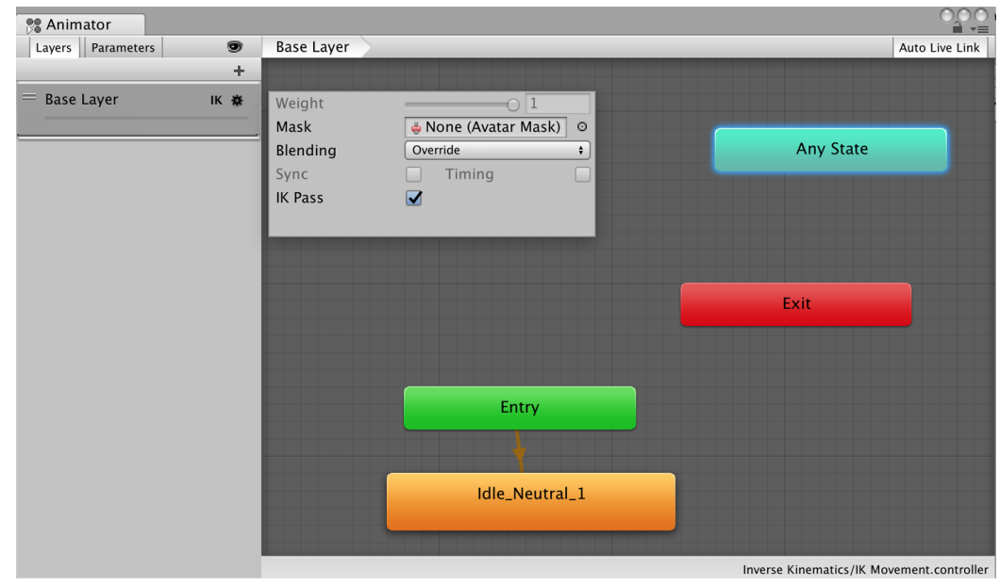.
    * Code mẫu của việc sử dụng IK Kinematics: [Code](https://github.com/Karysqa12xc/Unity-Learn-Basic/blob/main/Assets/_Scripts/Chapter08/Scriptings/IKReach.cs).
    * Sử dụng **Avartar Mask** để di chuyển một bộ phận cụ thể của GameObject(ưu tiên đối tượng có hình dáng con người).
    * Sử dụng **Blend Tree** trong Animator Controller để tạo hoạt ảnh mượt mà giữa các trạng thái.
    * **Cinematic Camera Tracking** được dùng để tạo các cảnh quay giống phim điện ảnh.
    * **Virtual Camera** là Camera dùng để luôn giữ một Object ở trong tầm nhìn.
    * **ClearShot Camera** sử dụng để setup nhiều máy quay ảo trong scene dùng để quan sát Object ở nhiều góc độ.
    * **CinemachineTargetGroup** dùng để cố gắng giữ nhiều vật thể trong máy ảnh(không áp dụng khi chạy game).
    * "Dolly Camera with Track": Tạo một camera di chuyển theo một hướng di chuyển vòng quanh một vật thể.
## Logic and GamePlay
* **Short:**
    * Cách để load Scene ta phải cho Scene đó vào Build Scene Setting và sử dụng hàm LoadScene trong lớp SceneManager.
    * Các cách load Scene: [Code](https://github.com/Karysqa12xc/Unity-Learn-Basic/blob/main/Assets/_Scripts/Chapter09/Scriptings/SceneBase.cs)
    * Để tạo chức năng khi một vật chạm vào một vật khác sẽ gây một lượng thương tổn nhất định và nếu đến giới hạn sẽ làm cho vật chịu thương tổn biến mất: [Gắn vào vật chịu thương tổn](https://github.com/Karysqa12xc/Unity-Learn-Basic/blob/main/Assets/_Scripts/Chapter09/Scriptings/DamageReceiver.cs), [Gắn vào vật gửi đi thương tổn](https://github.com/Karysqa12xc/Unity-Learn-Basic/blob/main/Assets/_Scripts/Chapter09/Scriptings/DamageGiver.cs)
    * Tạo một top-down camera di chuyển theo phím WASD: [Code](https://github.com/Karysqa12xc/Unity-Learn-Basic/blob/main/Assets/_Scripts/Chapter09/Scriptings/TopDownCameraMovement.cs)
    * Cách quản lý nhiệm vụ: [Thiết lập đối tượng lưu trữ thông tin](https://github.com/Karysqa12xc/Unity-Learn-Basic/blob/main/Assets/_Scripts/Chapter09/Scriptings/Quest.cs), [Tạo code quản lý trạng thái của quest](https://github.com/Karysqa12xc/Unity-Learn-Basic/blob/main/Assets/_Scripts/Chapter09/Scriptings/QuestManager.cs), [Tạo code gắn vào vật thể và cập nhật trạng thái của quest](https://github.com/Karysqa12xc/Unity-Learn-Basic/blob/main/Assets/_Scripts/Chapter09/Scriptings/ObjectiveTrigger.cs), [Tạo code để thực hiện quest](https://github.com/Karysqa12xc/Unity-Learn-Basic/blob/main/Assets/_Scripts/Chapter09/Scriptings/TriggerObjectiveOnClick.cs).
    * Tạo vùng lựa chọn giống các game chiến thuật như AOE và và StarCraft: [Code đọc thông tin của vật thể được chọn](https://github.com/Karysqa12xc/Unity-Learn-Basic/blob/main/Assets/_Scripts/Chapter09/Scriptings/BoxSelectable.cs), [Code thực hiện chức năng chọn vật thể](https://github.com/Karysqa12xc/Unity-Learn-Basic/blob/main/Assets/_Scripts/Chapter09/Scriptings/BoxSelection.cs).
    * Tạo các trang menu: [Tạo các Event với Menu](https://github.com/Karysqa12xc/Unity-Learn-Basic/blob/main/Assets/_Scripts/Chapter09/Scriptings/Menu.cs), [Tạo trình quản lý Menu](https://github.com/Karysqa12xc/Unity-Learn-Basic/blob/main/Assets/_Scripts/Chapter09/Scriptings/MenuManager.cs).
    * Cách sử dụng wheel collider(chỉ dùng cho các vật thể hình tròn có dạng bánh xe): [Code](https://github.com/Karysqa12xc/Unity-Learn-Basic/blob/main/Assets/_Scripts/Chapter09/Scriptings/Vehicle.cs)
    * Giảm thiểu việc xe không bị lật: [Code](https://github.com/Karysqa12xc/Unity-Learn-Basic/blob/main/Assets/_Scripts/Chapter09/Scriptings/AdjustCenterMass.cs).
    * Tạo vùng tăng tốc giống như các vùng trong game ZingSpeed hay Asphalt8: [Code](https://github.com/Karysqa12xc/Unity-Learn-Basic/blob/main/Assets/_Scripts/Chapter09/Scriptings/SpeedBoost.cs).
    * Tạo camera di chuyển bằng chuột và lấy một vật thể làm trung tâm: [Code](https://github.com/Karysqa12xc/Unity-Learn-Basic/blob/main/Assets/_Scripts/Chapter09/Scriptings/OrbitingCamera.cs)
    * Cách tạo CheckPoint trong game: [Code](https://github.com/Karysqa12xc/Unity-Learn-Basic/blob/main/Assets/_Scripts/Chapter09/Scriptings/CheckPoint.cs)
    * Tạo chỉ dẫn cho người chơi để người chơi biết mình đang đi đúng đường: [Code](https://github.com/Karysqa12xc/Unity-Learn-Basic/blob/main/Assets/_Scripts/Chapter09/Scriptings/LapTracker.cs)
## Behavior And AI
* **Short:**
    * Tạo chức năng phát hiện mục tiêu trong tầm ngắm của enemy 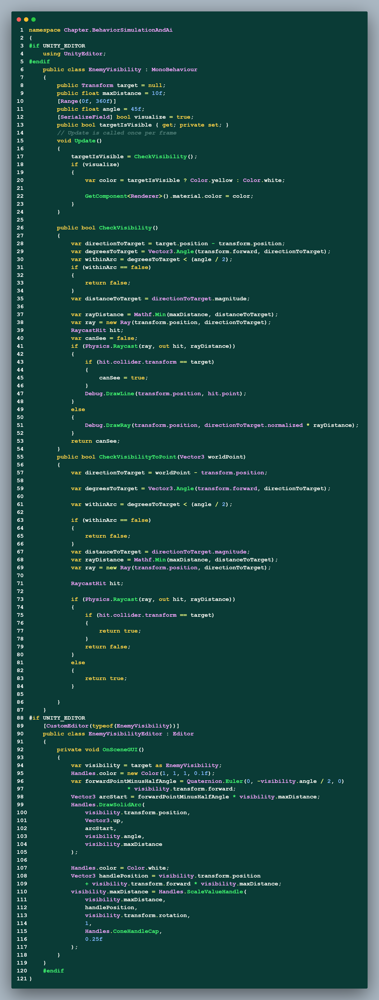
    * Tạo chức năng di chuyển tự động theo con chỏ chuộc bằng NavMeshAgent 
    * Tạo chức năng sinh ra các position ngẫu nhiên xung quanh vật thể 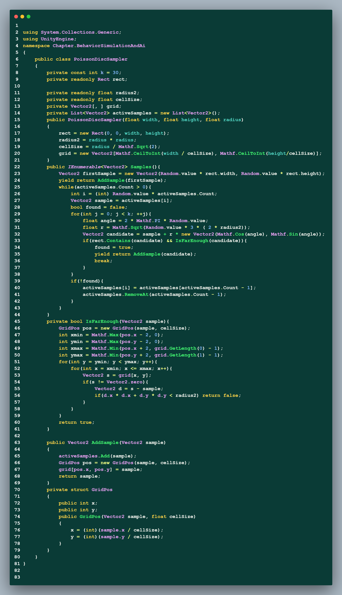
    * Test chức năng sinh ra các điểm ngẫu nhiên ở trên 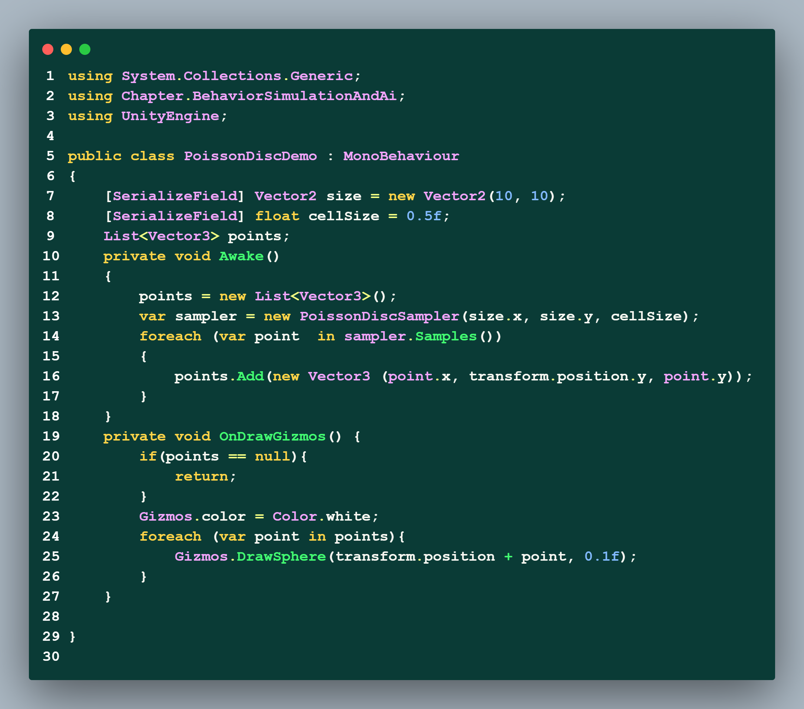
    * Người chơi hoặc Enemy tự động lẩn trốn khi bị phát hiện 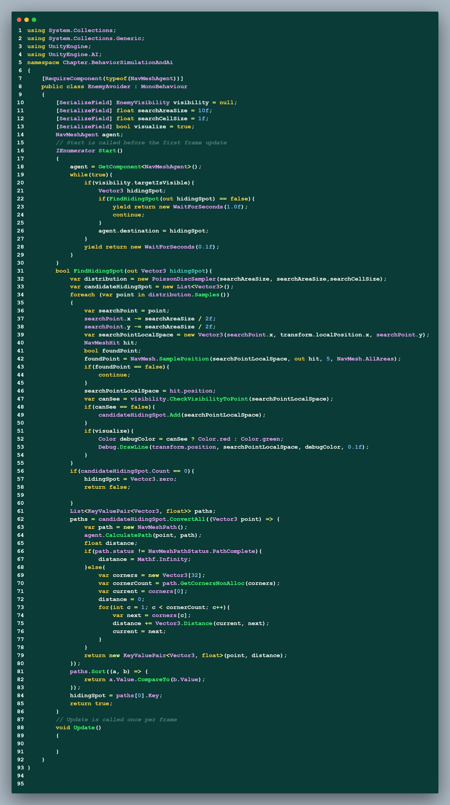
    * Chức năng state machine 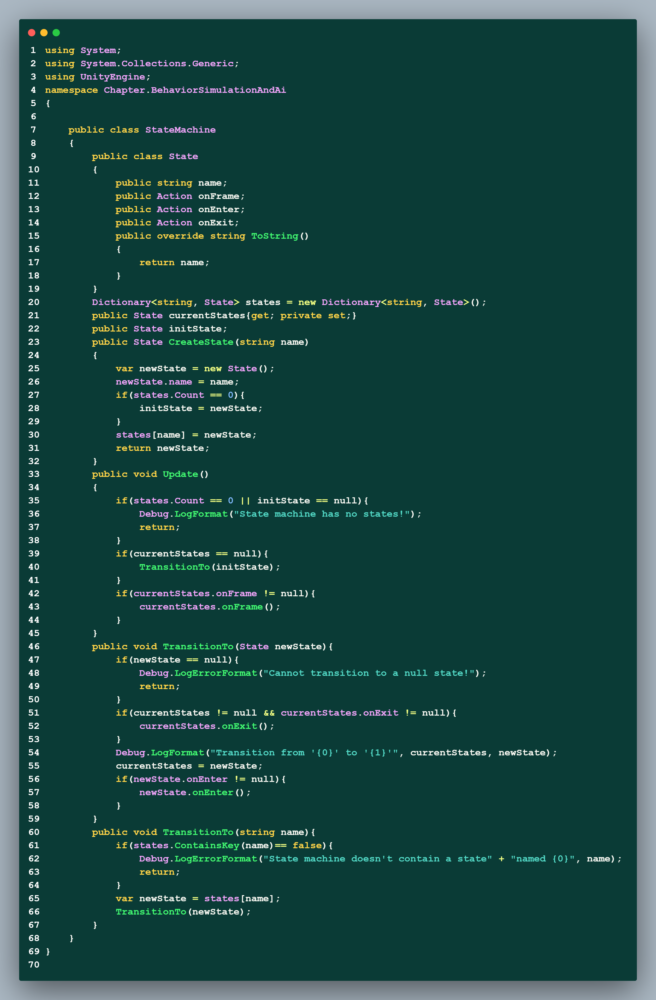
    * Cách sử dụng State Machine 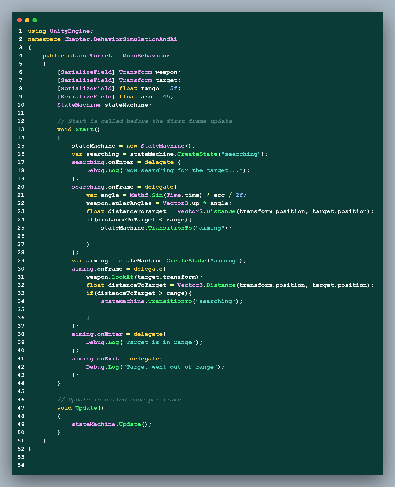
    * Cách sử dụng thư viện ML-Agents 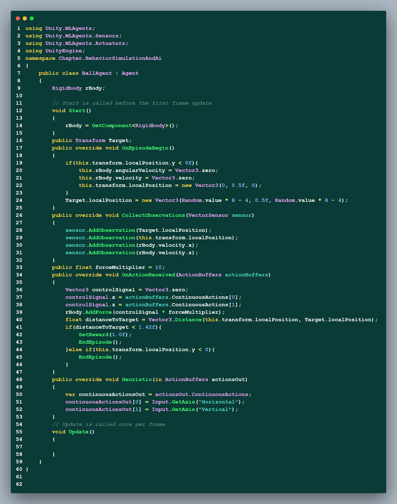
## Sound And Music
* **Short:**
    * Sử dụng AudioSource Component để phát âm thanh trong trò chơi
    * Sử dụng AudioMixer để trộn các âm thanh.
    * Sử dụng effect send and receiver của Audio Mixer đối với mỗi group để gửi đi âm thanh(lưu ý khi sử dụng phải tăng âm lượng của thành phần receiver lên tối đa)
    * Sử dụng Component Audio Reverb Zone để mô phỏng âm thanh của Cave hay một khu vực nhất định.
    * Sử dụng Ducking Effect để làm giảm âm lượng của một vật thể khi một vật thể khác phát ra âm thanh( thường được dùng khi có cuộc đối thoại giữa hai nhân vật trong game).
    * Các đoạn code sử dụng để hiệu chỉnh âm thanh 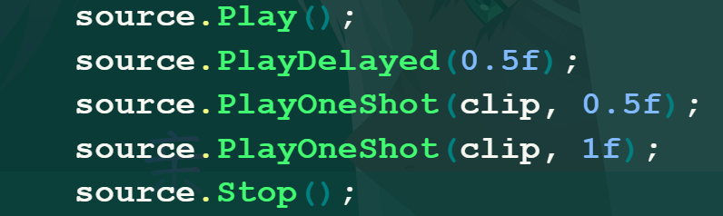
    * Đoạn code quản lý âm thanh khi sử dụng Singleton: (1) tạo một ScriptableObject [Code](https://github.com/Karysqa12xc/Unity-Learn-Basic/blob/main/Assets/_Scripts/Chapter11/Scriptings/SoundEffect.cs), (2) tạo một Scripting kế thừa Singleton [Code](https://github.com/Karysqa12xc/Unity-Learn-Basic/blob/main/Assets/_Scripts/Chapter11/Scriptings/AudioManager.cs)

