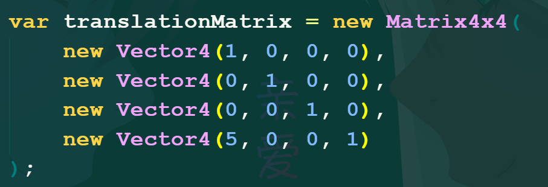
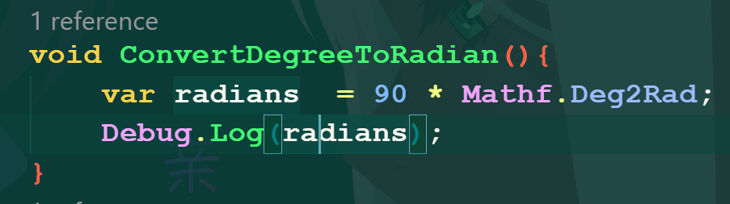

# Unity Learn Basic
## Working with Unity
* **Short cut:**
    - Ctrl + N: Tạo một GameObject Empty
    - Alt + Shift + N: Tạo một GameObject Empty trong một GameObject khác
    - Ctrl + = : Trỏ vào đối tượng đầu tiền trong một đối list các đối tượng con của một đối tượng khác
    - Ctrl + - : Trỏ vào đối tượng cuối cùng trong một đối list các đối tượng con của một đối tượng khác
## Scripting 
* **Short:**
    - Object Pool: Tạo các prefabs với hiệu năng cao hơn so với destroy
    - Singleton: Một design pattern được sử dụng để code không bị lặp và được khởi tạo một lần duy nhất( tác hại là code sẽ dễ bị phụ thuộc nên cần phải lưu ý )
## Input:
* **Short:**
    - Input System: Được cài đặt bằng Package Manager, đây là hệ thống quản lý điều kiểu object do unity tạo ra.
    - Có thể sử dụng các thuộc tính của Cursor để tác động lên con trỏ chuột trong trò chơi.
    - Sử dụng Event Systems và Camera được gắn Component Physics Raycaster và các Interface(IPointerEnterHandler,IPointerExitHandler,IPointerUpHandler,IPointerDownHandler,
    IPointerClickHandler) để chọn đối tượng trong trò chơi bằng con trỏ chuột.
## Mathematics(Vector, Rotating, Matrix, Angle)
* **Short:**
    - Tính khoảng cách giữa hai Vector: 
    - Chuẩn hoá Vector: 
    - Tính tích vô hướng giữa hai Vector: 
    - Quaternion có 4 giá trị(x, y, z, w)
    - Cách thực hiện phép quay: 
    - Sử dụng hàm Slerp để hoà trộn hai góc quay với nhau: 
    - Kết hợp Quaternion: 
    - Thao tác cơ bản với ma trận 4x4: 
    - Cách tạo ma trận 4x4 bằng Vector: 
    - Cách nhân vector với ma trận 4x4: 
    - Cách nối thủ công các ma trận với nhau: 
    - Cách nối các ma trận với nhau nhưng sử dụng hàm: 
    - Cách chuyển đổi góc có giá trị là độ sang radian: 
    - Cách chuyển đổi góc có giá trị là radian sang độ: 
    - Để tính góc giữa hai vector ta sử dụng hàm Acos của Mathf đối với tích vô hướng của hai vector: 
## 2D Graphics
* **Short:**
    - Để sử dụng hình ảnh trong Unity2D ta chỉ cần kéo hình ảnh đó vào thư mục trong cửa sổ Project của Unity và chuyển Texture Type thành Sprite (2D and UI).
    - Để sử dụng Sprite trong Scene thì GameObject đó phải có Component tên là "Sprite Renderer".
    - Dùng Custom Physics Shape trong Sprite Editor để xác định hình dạng Collider của Polygon Collider 2d.
    - Dùng Component Composite Collider để gộp chung các Collider con với nhau:
    - Sử dụng Sprite Atlas để sử dụng một gói các Sprite cho một texture duy nhất để tránh lạng phí bộ nhớ.
    - Sử dụng Component "Constant Force 2D" để tác động một lực vào vật thể được gắn Component này.
    - Dùng Effector để mô phỏng lực tự nhiên và một số chức năng mở rộng(Area Effector, Buoyancy Effector, Platform Effector, Surface Effector)
    - Sử dụng Component "Sprite Group" để hiển thị đồng thời các ảnh của GameObject con trong GameObject cha.
    - Để tạo Scene 2.5D ta chỉnh Projection của Camera thành Perspective và tạo một Background ở xa Camera, lúc này nếu di chuyển Camera sang trái hoặc phải sẽ tạo cảm giác 3d.
## 3D Graphics:
* **Short: **
    - Để tạo materials không ảnh hương bởi ánh sáng phản chiếu trong trò chơi thì chọn chế độ Unlit => Color cho material.
    - Dùng texture để tạo material chân thật có thể search trên các tranh như [ambientcg](https://ambientcg.com/) hay [polyhaven](https://polyhaven.com/)
    - Để tạo các hiệu ứng sử lý hậu kì cho Camera trong game ta dùng Component là post-processing effect(để có nó ta cài đặt trong package manager) => Hiệu ứng này chỉ có thể sử dụng ở 2D(Core) và 3D(Core) cụ thể là chỉ có thể sử dụng với Built-In Render Pipeline.
    - Đặc điểm của Built-In Render Pipeline là nó có thể tạo ra các hình ảnh với chất lượng tốt ở trên bất kỳ System nào nhưng đi kèm với nó là hiệu suốt để đáp ứng nó cần được tính toán cẩn thận.
    - Đối với 3D(URP) và 2D(URP) ta có thể tạo chức tiếp Post-Processing mà không cần tải Package bên ngoài bằng Volume Component(Đặc điểm của trình render này phù hợp với bất kỳ các loại cấu hình máy nào).
    - Sử dụng Shader Graph(Create → Shader →
    URP → Lit Shader Graph).
    - Để cho một đối tượng có thể ánh xạ ánh sáng ta vào cửa sổ Inspector chọn drop-down menu và chọn Contribute GI.
    - Tạo vật thể có thể phát ra ánh sáng(**Emission**): [Link](https://youtu.be/2PBgCl-zIZQ?si=xsuADgz6vmOd3-gT)
    - Sử dụng Light Probes: [Link](https://youtu.be/_E0JXOZDTKA?si=N4WyCSP8NttY_kUn)
    - Sử dụng Reflection Probes để tạo hình ảnh phản chiếu cho material trong môi trượng xung quanh(Có thể ứng dụng để tạo các hiệu ứng của gương): [Link](https://youtu.be/wol5bd3_bAQ?si=5DhS_n7q3t59KKAT)
    - Rendering Texture(có thể ứng dụng để tạo minimap)cách tạo(Create → Render Texture), sau đó tạo một Camera mới và kéo Render texture vừa tạo vào **Output Texture** => Sau đó tạo một Material và kéo Render Texture vừa tạo vào Albedo nếu ở Core và vào Base map nếu ở URP rồi kéo material đó vào một object bất kỳ để test.

